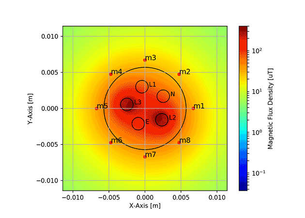

# MCMFS - Multi-Core (AC) Magnetic Field Simulation

A Jupyter Notebook based simulation tool to estimate magnetic fields in a multi-core cable. 



## Usage
**Import**

````python
from mcmfs.cable_simulation import Simulation
````

**Create simulation object**
````python
s = Simulation()
````
Creates the main simulation object with default parameter:
- fs: Sampling frequency [Samples/Sec] (default=3600)
- f0: Base frequency [Hz] (default=50)
- z: Number of periods to simulate [-] (default=5)
- res: Resolution of the mesh-grid [m] (default=2e-4) 
    - This parameter does not affect the accuracy of the simulation but only the visualization
- d: Outer diameter of the whole conductor [m] (default=11e-3)

**Define the cable by position and size of conductors**

All values in Meter
````python
s.add_L1(diam=1.74e-3, pos_x=-0.422e-3, pos_y=3.016e-3)
s.add_L2(diam=1.74e-3, pos_x=2.328e-3, pos_y=-1.568e-3)
s.add_L3(diam=1.74e-3, pos_x=-2.514e-3, pos_y=0.552e-3)
s.add_N(diam=1.74e-3, pos_x=2.529e-3, pos_y=1.698e-3)
s.add_PE(diam=1.74e-3, pos_x=-0.938e-3, pos_y=-2.113e-3)
````
**Set current and voltages**

Current values in Ampere, voltages in Volt and phase shift in Degree
````python
s.set_L1_I(A1=1, A3=0, A5=0, A7=0, Shift=0, Phi1=0, Phi3=0, Phi5=0, Phi7=0)
s.set_L1_V(A1=230, A3=0, A5=0, A7=0, Shift=0, Phi1=0, Phi3=0, Phi5=0, Phi7=0)

s.set_L2_I(A1=1, A3=0, A5=0, A7=0, Shift=-120, Phi1=0, Phi3=0, Phi5=0, Phi7=0)
s.set_L2_V(A1=230, A3=0, A5=0, A7=0, Shift=-120, Phi1=0, Phi3=0, Phi5=0, Phi7=0)

s.set_L3_I(A1=1, A3=0, A5=0, A7=0, Shift=120, Phi1=0, Phi3=0, Phi5=0, Phi7=0)
s.set_L3_V(A1=230, A3=0, A5=0, A7=0, Shift=120, Phi1=0, Phi3=0, Phi5=0, Phi7=0)
````
**Add Sensors**
````python
s.add_sensors(n=8)
````
**Run Simulation**
````python
s.run()
````
